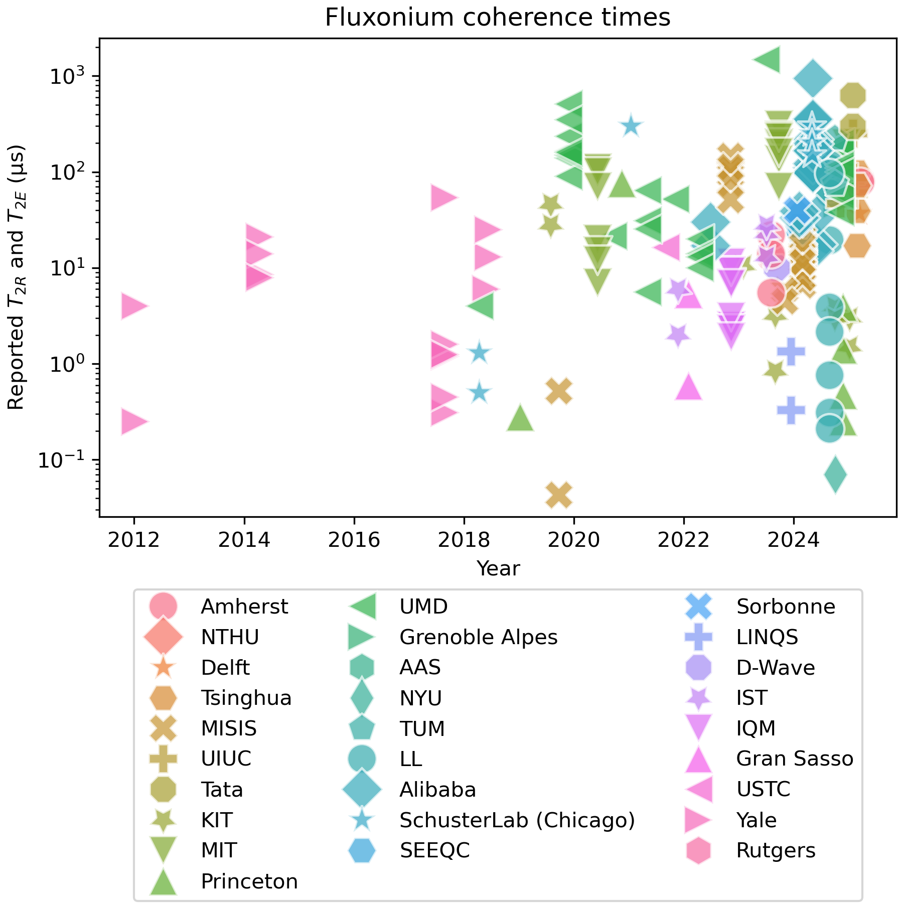

# FLUXONIUMDB ON GITHUB IS DEPRECIATED, SEE NOTION

For a more current version of the database, please use this website: https://fluxoniumdb.notion.site/

https://fluxoniumdb.notion.site/

https://fluxoniumdb.notion.site/

https://fluxoniumdb.notion.site/

https://fluxoniumdb.notion.site/

# FluxoniumDB

Collection of data on all measured fluxonium.

This database has >190 qubits, >70 papers, with that number continually growing. In the immediate future, information about gates will be added.

## Using the csv database

The file `processing_EXAMPLE.ipynb` gives an example of importing the provided database `fluxonium.csv` file into a `pandas.DataFrame` python object and generating the plot above. 

## Contributing

If you notice a mistake, or a paper that hasn't been included, please feel free to raise a github Issue/pull request! There are certain to be some typos and incorrectly copied information. Also, if you have some other info you would like to track, feel free to suggest it there as well!

Or send an email to Paul Varosy, the maintainer of the database at varosy at stanford.edu.

## Fluxonium Zotero library

Paul Varosy has also collected nearly every paper somehow relating to fluxonium into a single Zotero library: https://www.zotero.org/groups/5489813/fluxonium. Feel free to use this as a resource for learning more about fluxonium!
